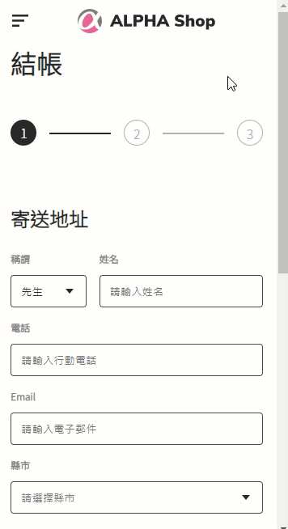
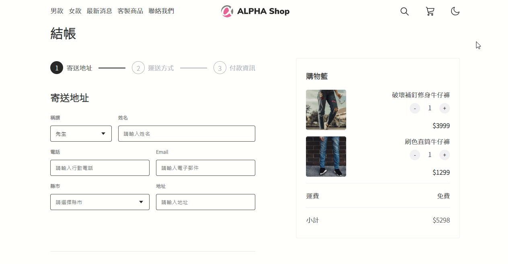

# 成品網址
https://tzynwang.github.io/ac_assignment_3F_ALPHA-Shop/

# 本機運行
1. `git clone https://github.com/tzynwang/ac_assignment_3F_ALPHA-Shop.git`
1. `cd ac_assignment_3F_ALPHA-Shop`
1. `git checkout refact-vue-project`
1. `npm i`
1. `npm run serve`
1. 根據終端機提供的網址進行連線，例：`http://localhost:8080/`
1. 於終端機按兩次`Ctrl`+`c`結束連線

# 測試用信用卡資料
卡號：5105105105105100
CVC：123

# 時間記錄
## 第五次練習
- 約二小時：處理在background-image中使用`var()`來實作light/dark mode時不同的`input type="month"`圖示

## 第四次練習
- 第一小時：環境建置、HTML架構、配置素材、CSS reset、vue dark mode基本邏輯設定
- 第二小時：header大小版、progress bar大小版（皆含dark mode）
- 第三小時：表單三區塊小版
- 第四小時：表單三區塊大版
- 第五小時：大小版排版基本完成，vue購物車訂單金額計算邏輯完成
- 第六小時：新增搜尋欄位視覺效果，vue邏輯全部完成

# 展示

# 技術參考
## HTML
- [What is the correct input type for credit card numbers?](https://stackoverflow.com/questions/48534229/what-is-the-correct-input-type-for-credit-card-numbers)

## CSS
- [text-indent](https://developer.mozilla.org/en-US/docs/Web/CSS/text-indent): move placeholder text position
- [Ant Design Pro: 分步表單](https://preview.pro.ant.design/form/step-form)

## vue
- [How to call multiple functions with @click in vue?](https://stackoverflow.com/questions/38744932/how-to-call-multiple-functions-with-click-in-vue)
- [In vue.js component, how to use props in css?](https://stackoverflow.com/a/52280182/15028185)